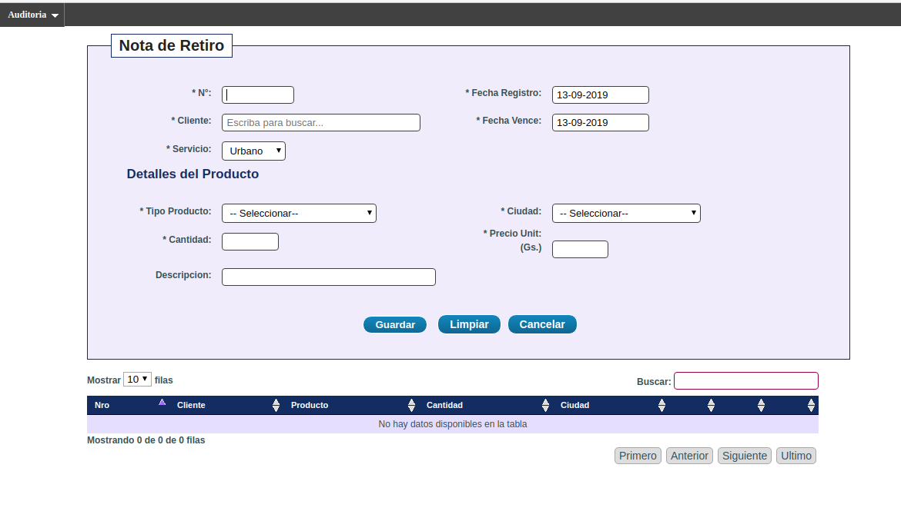

# Courier Management System
It is a web application developed using the Ruby On Rails framework. 
Below there are some screenshots of some app features 
I developed it between the years 2010 ~ 2011 with a team of 3 members for a local company. 
I used the following technologies in the development  
. Ruby on Rails 3.2  
. Devise, CanCan for authorization, authentication and roles.  
. Postgresql as database  
. Bootstrap, HTML5, SaaS  
. Prawn PDF for report generator  
. Unicorn, Nginx, Digital Ocean VPS 
The main features of the app are:  
. Home page with fast access menus  
. Register/Search product page 
. Register/Search employees  
. Register countries, cities, delivery address and package type 
. Retire notes 
. Routing Sheets 
. Invoice and more 

