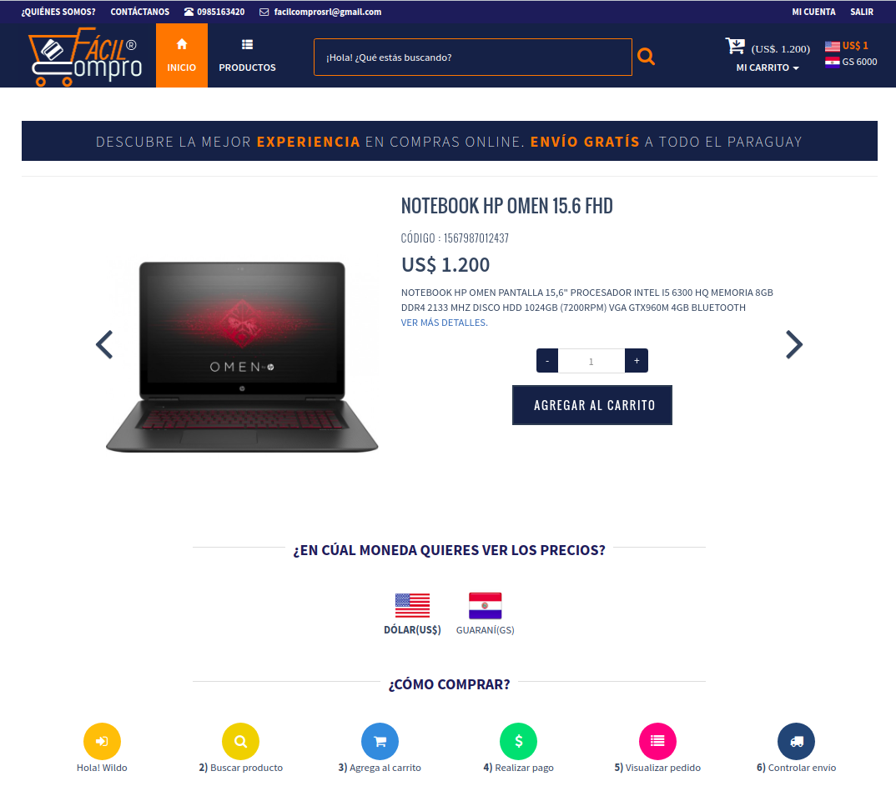
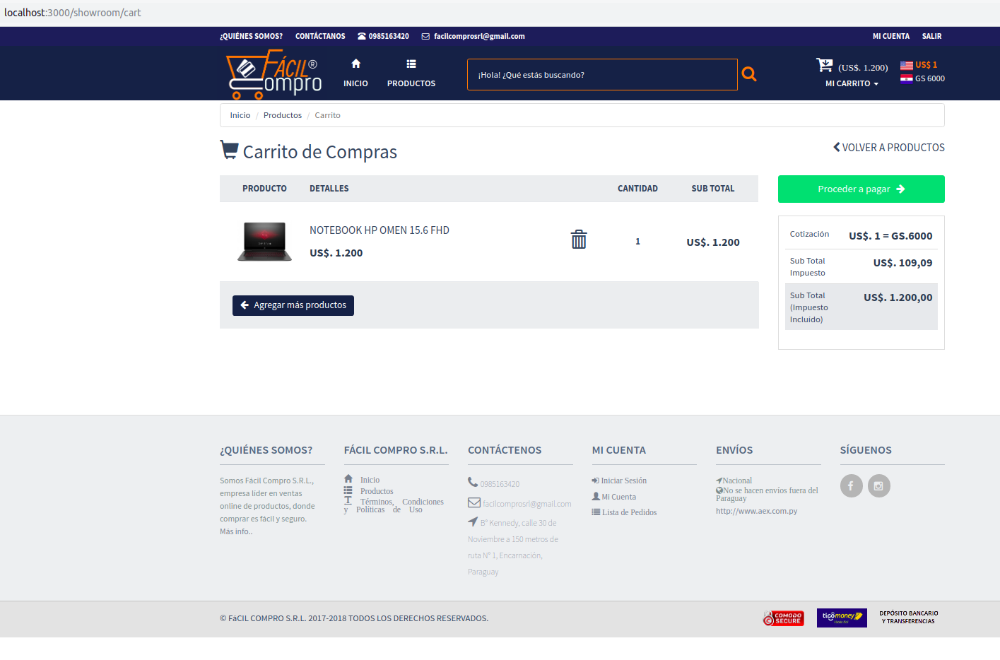
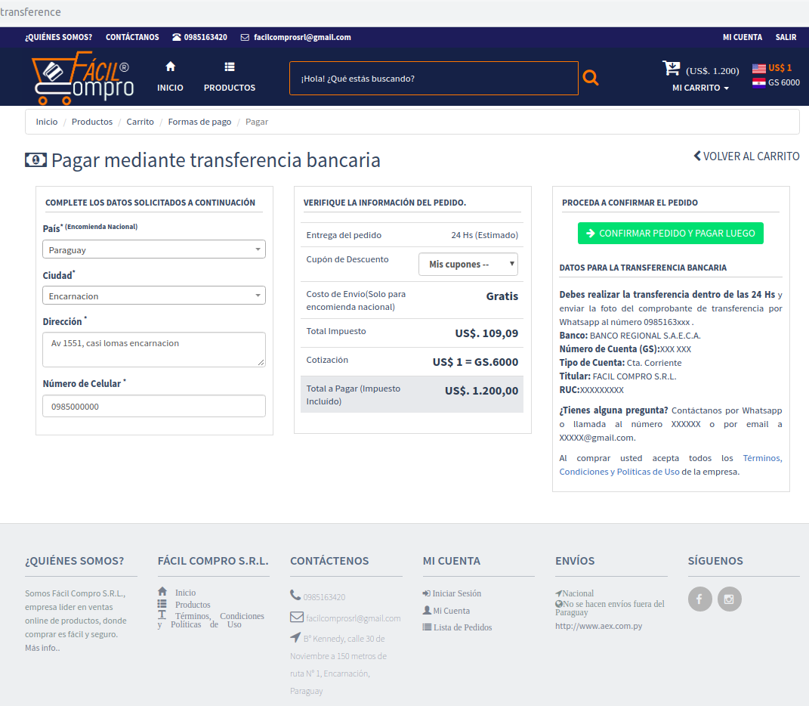
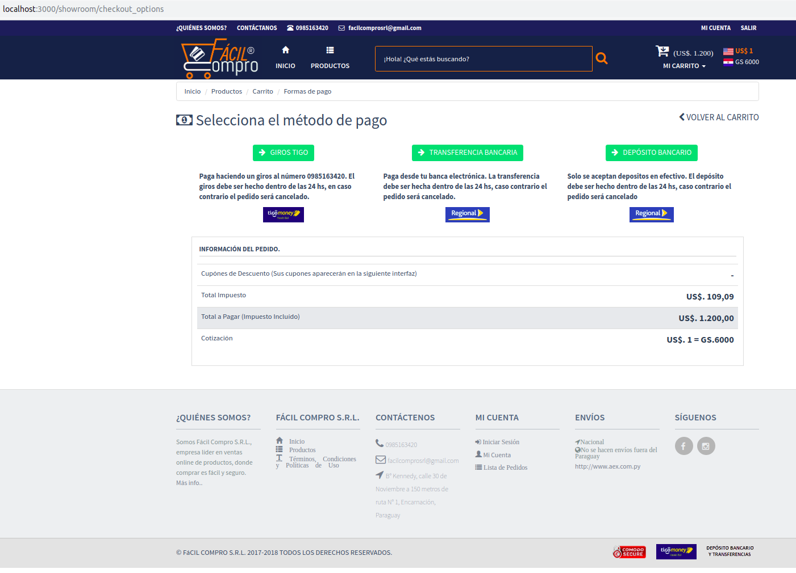
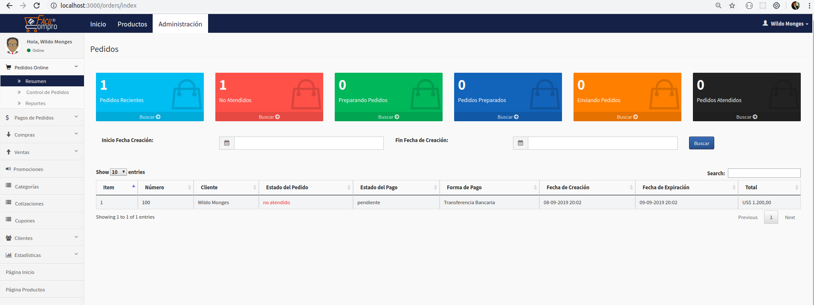

# README

In this folder, I want to share with you some screenshots of my personal project named FacilCompro. 
It is an ecommerce application I developed between the years 2016 ~ 2017 completly alone from zero. 
I used the following technologies in the development  
. Ruby on Rails 4.0  
. Devise, CanCan for authorization, authentication and roles.  
. Postgresql as database  
. Bootstrap, HTML5, SaaS  
. Sentry.io as log service  
. Prawn PDF for report generator  
The main features of the app are:  
. Home page with an input search  
. Shopping cart page  
. Checkout page  
. Products by categories page  
. Admin page to register productos, categories, promotions and more.  

