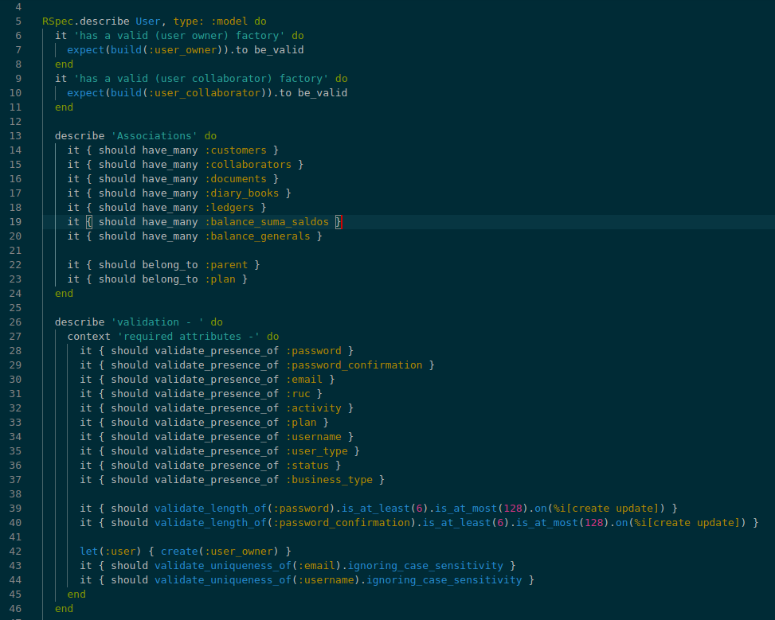

# TDD, BDD using Rspec and Capybara

In this how-to, I implemented tests using the following approach TDD, BDD.
Gem used for this demo: rspec, capybara, faker, factory-bot and shoulda-matchers.
The test files are under /spec, and the models under /app/models.

