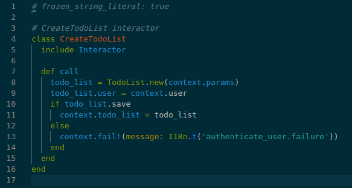
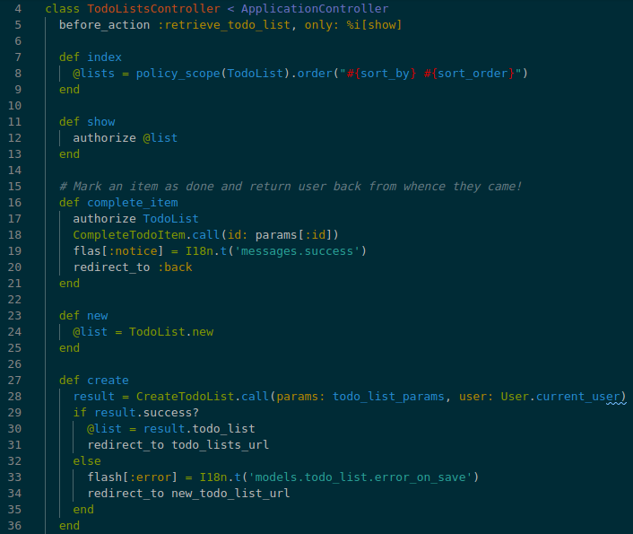

# README

In this challenge, I refactored a code pulled from https://gist.github.com/maxrice/d744b4a5bff9ce135de9d9dd01a31664.
This was a code challenge, the goal was to find issues and refactor the default code.
I decided to refactor using object services with interactor gem to keep the code simple, readable, testeable and scalable.

and below how I used into the controller

